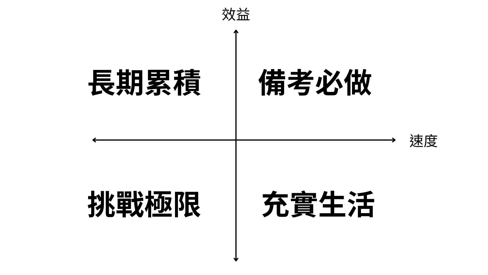
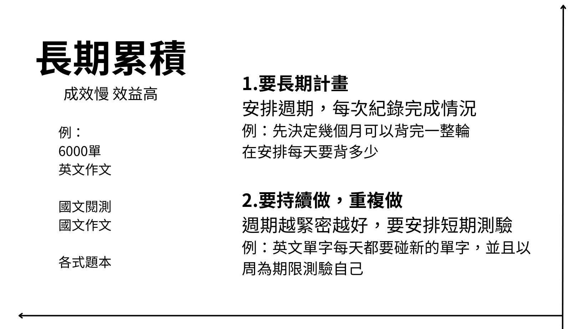
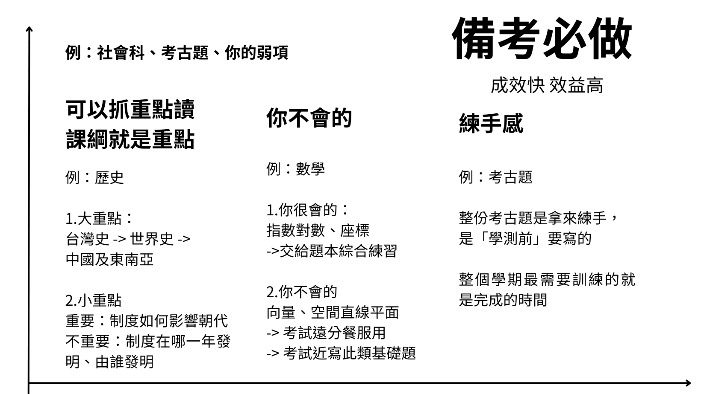
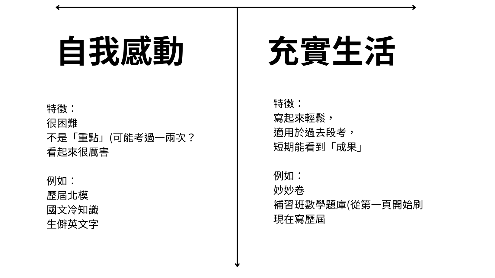

class: middle

```{r setup, include=FALSE}
knitr::opts_chunk$set(echo = TRUE)
library('xaringan')
library('reticulate')
library("renderthis")
library("ggplot2")
library("tidyverse")
library("gganimate")
library(echarts4r)
xaringanExtra::use_panelset()
xaringanExtra::use_webcam()
xaringanExtra::use_tile_view()
xaringanExtra::use_broadcast()
xaringanExtra::use_tachyons()
```

## 認識策略與工具

## 因為時間有限

.bg-washed-green.b--dark-green.ba.bw2.br3.shadow-5.ph4.mt5[
考試不是比誰投入的最多時間，況且要比時間，你們也...

.tr[
— 某個有智慧的人
]]


---
class: middle


```{r, out.width = '100%',echo=FALSE, fig.align='center'}

```

---
class: middle


```{r, out.width = '100%',echo=FALSE, fig.align='center'}

```

---
class: middle


```{r, out.width = '100%',echo=FALSE, fig.align='center'}

```

---
class: middle


```{r, out.width = '100%',echo=FALSE, fig.align='center'}

```


---
class: middle

長期累積：作文、閱讀測驗

短期成效：題本(考前歷屆)、國學常識


```{r, echo = FALSE}
data3 <- tribble(
  ~時間, ~作文, ~閱讀, ~題本, ~國學常識,
  "暑假", 3.5, 3.5, 1.5, 1.5,
  "ㄧ模", 3.5, 2.5, 2.5, 1.5,
  "二模", 3.5, 1.5, 3.5, 1.5,
  "學測前", 2, 0, 4, 4,
)

data3 <- data3 %>%
  mutate(時間 = factor(時間, levels = c("暑假", "ㄧ模", "二模", "學測前")))

```


```{r, echo = FALSE}
data3 %>%
  pivot_longer(c("作文","閱讀","國學常識", "題本"), 
               names_to = "類型", values_to = "佔比")%>%
  group_by(時間) %>%
  e_charts(類型, timeline = TRUE) %>%
  e_pie(佔比, roseType = "radius") %>%
  e_tooltip(
    formatter = htmlwidgets::JS("
      function(params) {
        var note = {
          '暑假': '難：國、英手寫題時間配置問題<br>解：維持進度、增加手寫頻率',
          'ㄧ模': '難：英手寫失分多、數難題卡時間<br>解：翻譯與作文增加頻率、加強部分',
          '二模': '難：總體時間控制得當<br>解：加強手寫、放棄部分數題',
          '學測前': '放寒假'
        };
        var text = note[params[0].name] || '';
        return '<div style=\"font-size: 20px;\">' + text + '</div>';
      }
    ")
  ) %>%
  e_legend(show = TRUE)
```

---
class: middle

考試前期：強項分給弱項時間

考試後期：時間平均，多花時間在「重點科目」

```{r, echo = FALSE}
data4 <- tribble(
  ~時間, ~國文, ~英文, ~數學, ~社會, 
"暑假", 2.5, 2.5, 3, 2, 
"ㄧ模", 2.5, 3, 3, 1.5,
"二模", 2.5, 3, 3.5, 1,
"學測前", 2.5, 3, 2.5, 2,
)

data4 <- data4 %>%
  mutate(時間 = factor(時間, levels = c("暑假", "ㄧ模", "二模", "學測前")))

```


```{r, echo = FALSE}
data4 %>%
  pivot_longer(c("國文","英文","數學", "社會"), 
               names_to = "類型", values_to = "佔比") %>%
  group_by(時間) %>%
  e_charts(類型, timeline = TRUE) %>%
  e_pie(佔比, roseType = "radius") %>%
  e_legend(show = TRUE)
```

---
class: middle


```{r, echo = FALSE}
data1 <- tribble(
  ~時間, ~國文, ~英文, ~社會, ~數學, ~備註,
  "一模", 13, 13, 13, 8,   "難：國、英手寫題時間配置問題\n解：維持進度、增加手寫頻率",
  "二模", 15, 14, 15, 11,   "難：英手寫失分多、數難題卡時間\n解：翻譯與作文增加頻率、加強部分",
  "三模", 14, 14, 14, 10,   "難：總體時間控制得當\n解：加強手寫、放棄部分數題",
  "學測", 15, 13, 15, 13,   "放寒假"
)

data1 <- data1 %>%
  mutate(時間 = factor(時間, levels = c("一模", "二模", "三模", "學測")))

```


```{r, echo=FALSE, out.width='25%' }

data1 %>%
  mutate(total = 國文+英文+數學+社會)%>%
  group_by(時間) %>%
  e_charts(時間, timeline = TRUE) %>%
  e_line(total, name = "成績", symbolSize = 20) %>%
  e_bar(國文)%>%
  e_bar(英文)%>%
  e_bar(社會)%>%
  e_bar(數學)%>%
  e_title("成績變化") %>%
  e_x_axis(name = "時間") %>%
  e_y_axis(name = "成績", min = 0, max = 60) %>%
  e_legend(show = TRUE)%>%
  e_labels(show = TRUE) %>%
  e_tooltip(
    trigger = "axis",
    formatter = htmlwidgets::JS("
      function(params) {
        var note = {
          '一模': '難：國、英手寫題時間配置問題<br>解：維持進度、增加手寫頻率',
          '二模': '難：英手寫失分多、數難題卡時間<br>解：翻譯與作文增加頻率、加強部分',
          '三模': '難：總體時間控制得當<br>解：加強手寫、放棄部分數題',
          '學測': '放寒假'
        };
        var text = note[params[0].name] || '';
        return '<div style=\"font-size: 20px;\">' + text + '</div>';
      }
    ")
  )
```


