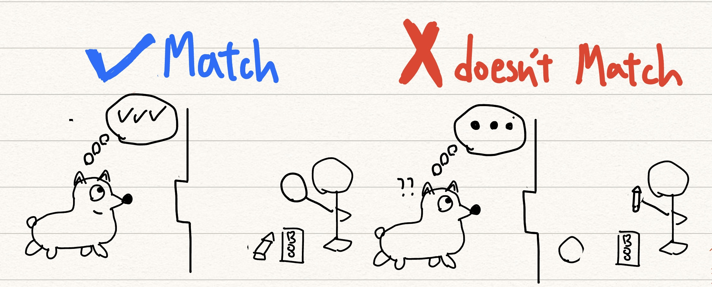

```{r setup, include=FALSE}
knitr::opts_chunk$set(echo = TRUE)
library('xaringan')
library('reticulate')
library("renderthis")
xaringanExtra::use_panelset()
xaringanExtra::use_webcam()
xaringanExtra::use_tile_view()
xaringanExtra::use_broadcast()
```


class:inverse2


Class and name: Thursday D56, 董宸賓<br>

Article Title: “Dogs can match some words with objects, study suggests”<br>

Author: Issy Ronald<br>

Website: CNN<br>

URL: https://edition.cnn.com/2024/04/01/world/dogs-words-objects-study-intl-scli-scn/index.html<br>

Date of Article: April 1, 2024

---

class: bkb, middle

### When we use "dog" in a sentence...

.pull-left[

dog food：sth you mess up

```{r, out.width = '90%',echo=FALSE}

```

]

--

.pull-right[

also in Chinese...

<br>

```{r, out.width = '90%',echo=FALSE}

```

]

---

class: bkb

### but they make several goods to our society...


```{r, out.width = '100%',echo=FALSE}

```

---

class: inverse2, middle

## Why dogs?

- Sturdy body

- Strong sense of feeling

- smart brain

- high obedience

---

class: inverse2

### In the past, we thought dogs can only understand simple "verbs", and study showed the same result by involved them fetching specific objects when asked...


```{r, out.width = '90%',echo=FALSE}

```

---

## THE NEW EXPERIMENT

```{r, out.width = '110%',echo=FALSE, fig.align='center'}

```


---

###  RESULT1：Familiar and unfamiliar objects

If the noun is familiar to the dog, there will be a greater response in the dog's brain.

```{r, out.width = '100%',echo=FALSE}

```

---

###  RESULT2：Matching words with objects

when a dog understands a word, it means in the absence of the object, the dog activates a so-called mental representation, thus...

```{r, out.width = '100%',echo=FALSE}

```


---

## Holding a hesitant attitude...

- the experiment was a “clever” concept but it showed dogs understood a “stimulus” followed by an “important consequence” rather than the meaning intrinsic to a word.

- dogs lacked the two areas of the brain crucial for human understanding of language therefore the EEG pattern highlighted by the researchers was not shared by humans.

- If we’re making a claim that the pattern of the brainwave shows you that it must be an understanding of words, you need it to be the same pattern

---

class: inverse2, middle

## If we can train dogs better...

.pull-left[

```{r, out.width = '100%',echo=FALSE}

```

]

.pull-right[

```{r, out.width = '80%',echo=FALSE}

```

]


---

class: inverse2, middle

### Rapidly advancing neuroscience...

--

### can lead to exciting prospects for understanding our own brains

--

### but also...

### infringe upon our privacy and  rights

```{r, out.width = '50%',echo=FALSE}

```

---
class: center, middle, inverse


## 謝謝聆聽

--
```{r, echo=FALSE, out.width="30%"}
knitr::include_graphics("sheepgif/sheep.gif")
```
--

THE END
