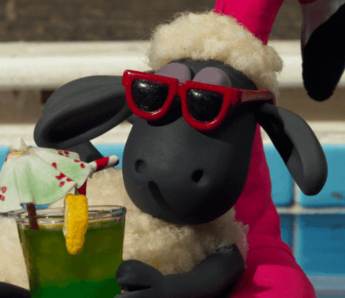

```{r setup, include=FALSE}
knitr::opts_chunk$set(echo = TRUE)
library('xaringan')
library('reticulate')
library("renderthis")
xaringanExtra::use_panelset()
xaringanExtra::use_webcam()
xaringanExtra::use_tile_view()
xaringanExtra::use_broadcast()
xaringanExtra::use_extra_styles(
  hover_code_line = TRUE,         #<<
  mute_unhighlighted_code = TRUE  #<<
)
```


class:inverse2,center

## 動機

.text-align[

### 生活化：能互動機器人

受新年常見對話練習器啟發，挑戰以笑話為主題效仿

### 冷笑話：有趣導向

想為沈悶得期中帶來樂趣，讓死板的機器人講出繽紛的笑話

### 故事性：增加遊戲的帶入感

用簡單的程式碼就能製作出RPG手遊，不亦樂乎

]

---
class:inverse2,center

## 規則

.text-alignl[


### 透過回答選擇題的方式進行

### 基礎題答錯-1分，進階題-2分，魔王題-3分

### 在有限的生命內，將3個關卡破完觸發結局獲勝

### 答題錯誤有提示，生命歸零則要重新挑戰


]

--

### 歡迎大家踴躍參與回答!

(將你們的答案打在google meet上)

---

class:inverse2

## 如何實踐

```{}
set()

while flag != 2:
  
    if flag == 1:
      set()
    
    關卡set()
    
    if 關卡 == 1:
      ...
      關卡1("1", "大樹與小樹差在哪裡？", "1：土裡，2：大小", "沒錯就是插在土裡","再思考一次~")
      ...
    elif 關卡 == 2:
      ...
      關卡2("3", "哪種螞蟻不能做朋友？", "1：白蟻，2：紅🐜，3：蟻后", "蟻后別做朋友~","周興哲")
      ...
    elif 關卡 == 3:
      print("嘿嘿嘿，看來你也挺無聊的嘛")
      ...
      關卡3("2", "趕走貓咪要用什麼？", "1：掃把，2：斯斯，3：魚乾", "感冒(貓)用斯斯","廣告歌曲")
      ...
      
    if x == 0:
        flag = int(input("重新挑戰?\n1：yes，2：no："))
    else:
      關卡reset()

```


---

class:bkb,center
.pull-left[
## 文字流程
.text-alignl[
1.初始化血量與使用者名稱

2.讓使用者選擇關卡

3.進入關卡

- 失敗：是否重新開始<br>
是：返回第1點<br>
否：結束執行

- 成功：是否挑戰下一關<br>
是：返回第2點<br>
否：結束執行


]
]

--

.pull-right[
## 程式架構
.text-alignl[
1.set(x = 生命，name = 名字)

2.set關卡(關卡 ＝ 1,2,3)

3.if關卡=1 elif關卡=2...

- if x == 0，input(flag= ?)<br>
flag == 1：回到set()<br>
flag == 2：break

- else：關卡reset(flag = ?)<br>
flag == 3：回到set關卡()<br>
flag == 2：break

]
]

---
class: bkb

## 用變數控制流程

**x = 血量**

當血量為0時

1. 告訴關卡function別再進入

2. 提問使用者是否重新挑戰

--

**flag = 主流程控制**

- flag == 2 -> 跳出迴圈，遊戲結束

- flag == 1 -> 重新開始且需要重新設定生命與名字

- flag == 3 -> 挑戰別的關卡，不需要重新設定

---
class: inverse2,center

## functional programming

.text-alignl[
如果要讓每一小題都能判斷生命值，題目對錯，你可能會寫出這樣的程式碼...

```{}
if 關卡 == 1:
      print("歡迎來到基礎題，看在你第一次來...本題目答錯只扣總分一分!")
      print("接受試煉吧")
      while x!=0:
        if x == 0:
            print("你沒命囉")
            break

        answer = input(f"大樹與小樹差在哪裡\n1：土裡，2：大小：")
        
        if answer == 1:
            print("沒錯就是插在土裡")
            break
      
        attack(1)
        print(f"提示：再思考一次~")
      
      while x!=0:
        if x == 0:
            print("你沒命囉")
            break

        answer = input(f"🐘的媽媽是?\n1：：長頸鹿，2：猩猩，3：阿不就大象：")
        
        if answer == 1:
            print("因為相由心生")
            break
          
        attack(1)
        print(f"提示：一個成語")

```
]

---
class: inverse2

## Why functional programming

remember：

代碼是寫給機器看的，函式是寫給人與機器的

賦予每個function容易聯想的名稱，使其更好懂

repeat：

Don't repeat yourself!

減少重複粘貼發生的錯誤

reuse：

隨著需求的改變，你只用在一個地方更新代碼

將常用、有共同點但又有些許不同的程式重複使用


---

class: inverse2

## 回頭看看我們的目標


.pull-left[
每個大題需要...

- 客製化不同大題的死亡提示

- 不同大題扣不一樣的分數
  
- 區分不同的規則樣態
]
--

.pull-right[
每個小題分別有...

- 答案

- 問題

- 問題選項

- 解釋

- 提示
]

---

class: inverse2

```{r, out.width = '130%',echo=FALSE}
knitr::include_graphics("libs/p3.png")
```

---

class: inverse2,center

## 放進main class

.text-alignl[
```{}
if 關卡 == 1:
      print("歡迎來到基礎題，看在你第一次來...本題目答錯只扣總分一分!")
      print("接受試煉吧")
      關卡1("1", "大樹與小樹差在哪裡？", "1：土裡，2：大小", "沒錯就是插在土裡","再思考一次~")
      關卡1("1", "哪個國家不販售組合套餐？", "1：丹麥，2：台灣", "因為單賣~","台灣不是國家= = ")
      關卡1("2", "🐘的媽媽是？", "1：長頸鹿，2：猩猩，3：阿不就大象", "因為相由心生","一個成語")
    elif 關卡 == 2:
      print("看來你透過基礎題之考驗了呢，接下來一題要扣兩分呢")
      print("請享受接下來的饗宴吧")
      關卡2("3", "哪種螞蟻不能做朋友？", "1：白蟻，2：紅🐜，3：蟻后", "蟻后別做朋友~","周興哲")
      關卡2("2", "哪個皇帝最漂亮？", "1：武則天，2：秦始皇，3：慈禧太后", "因爲他暴政(爆正)","你知道...皇帝都是指男生嗎？")
      關卡2("2", "🦆的那個部位最瘦？", "1：尾巴，2：嘴巴，3：腳", "鴨嘴獸泰瑞~","特務P！")
    elif 關卡 == 3:
      print("嘿嘿嘿，看來你也挺無聊的嘛")
      print("與冷笑話決一死戰吧")
      print("warning：本題答錯可是要扣3分阿")
      關卡3("2", "趕走貓咪要用什麼？", "1：掃把，2：斯斯，3：魚乾", "感冒(貓)用斯斯","廣告歌曲")
      關卡3("1", "哪種食物老了才會怕貓？", "1：薯條，2：罐頭，3：魚", "因為會變老🐭(薯)~","諧音梗combo")
      關卡3("3", "誰不能用手打手槍？", "1：女生，2：總統，3：神仙", "因爲仙人掌有刺","ㄟ嘿想不到吧")
```
]
---

class: bkb,center

## Four Module

--
.panelset.sideways[
.panel[.panel-name[set()]
.text-alignl[
1.用globalkeyword 去修改與獲取main class的值

2.讓使用者能設定血量與名字

3.透過while loop讓使用者能確認設定
```{}
def set():
    global name
    global x
    answer = 3
    while True:
        if answer == 1:
            break
        else:
            x = int(input("輸入生命值"))
            name = str(input("輸入名字："))
            print(f"你要叫做{name}，並且有{x}條生命嗎？")
            answer = int(input("是輸入1，重新設定輸入2:"))
```

]
]
.panel[.panel-name[attack()]

.text-alignl[

1.一樣先獲取x variable

2.填入數字，將其指派為variable a

3.將x-a，代表剩下的生命

4.print出提示語句

```{}
def attack(a):
    global x
    x = x - a
    print(f"你只剩下{x}機會了")
```
]
]
.panel[.panel-name[關卡set()]

.text-alignl[

1.選擇欲挑戰的關卡

```{}
def 關卡set():
  global name
  global 關卡
  關卡 = 0

  print(f"{name}，請選擇你的關卡")
  print("建議您，循序漸進...")
  關卡 = int(input("選擇你的關卡\n1：基礎題、2：進階題、3：魔王題："))
```
]
]
.panel[.panel-name[關卡reset()]

.text-alignl[

1.透過前面設定的關卡variable，判斷要給哪種結尾

2.設置flag，判斷要離開遊戲還是再次選擇關卡

```{}
def 關卡reset():
  global flag
  global 關卡
  if 關卡 == 1:
    print("基礎題結束，快點進入下一題吧")
  elif 關卡 == 2:
    print("恭喜通過進階題，接下來是更困難的挑戰!")
  elif 關卡 == 3:
    print("恭喜通過魔王題")
  flag = int(input("挑戰別的關卡?\n3：yes，2：no"))
```
]
]

]


---

layout: true
class: inverse2

## 省思與目標

---

### 1.對python不夠熟悉，開發時間長

### 2.溝通效率低落

### 3.時間不足，程式碼不夠完備

### 4.協作性與互動性不足

---

### 1.繼續精熟python

### 2.提早作業，提升效率

### 3.擴充程式碼，豐富劇情

### 4.建立良好的協作模式

---

layout: false


### 董：如果說第一次的專案是最基礎紮實的訓練，<br>這次的報告讓我體驗到python的樂趣與實踐


--

### 楊：沒有標準答案的科目此程非彼程<br>本是同根生/多練習


```{r, out.width = '40%',echo=FALSE,fig.align = 'center'}

```

