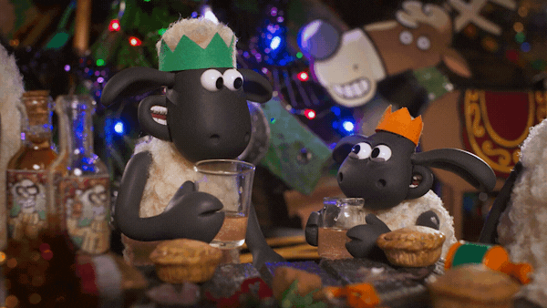
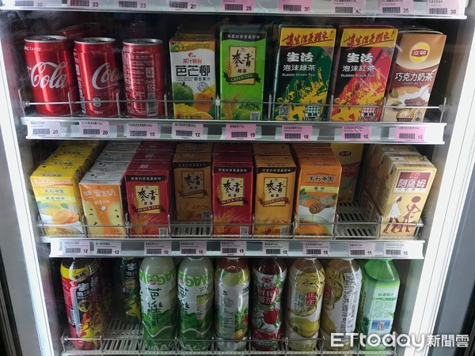
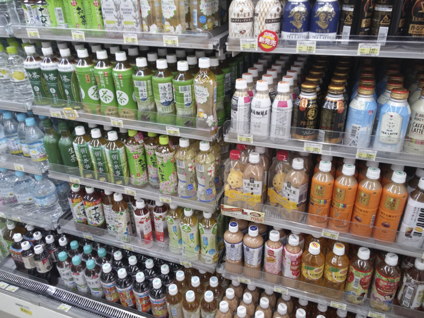
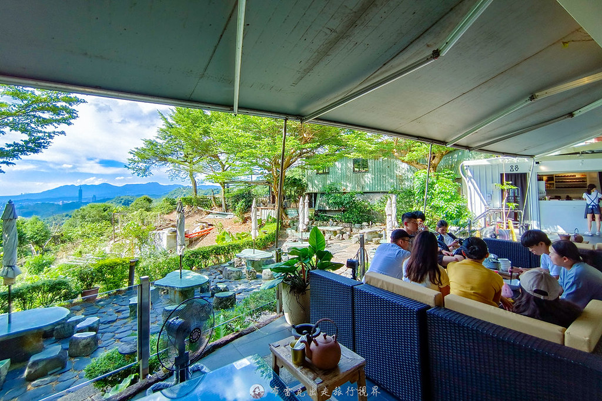
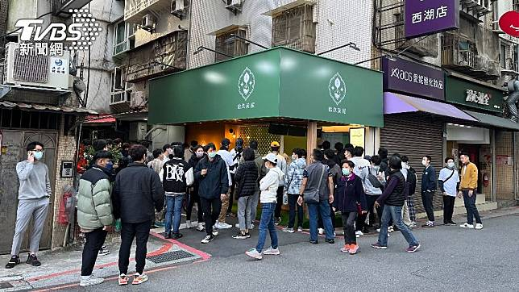
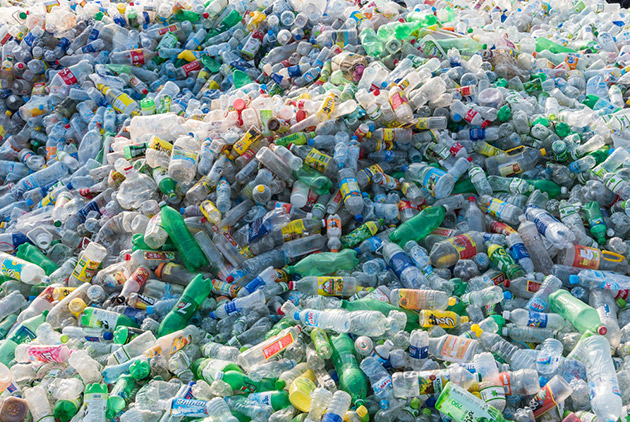
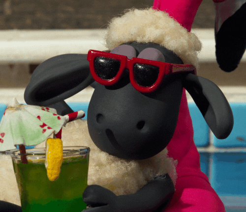

```{r setup, include=FALSE}
knitr::opts_chunk$set(echo = TRUE)
library('xaringan')
library('reticulate')
library("renderthis")
xaringanExtra::use_panelset()
xaringanExtra::use_webcam()
xaringanExtra::use_tile_view()
xaringanExtra::use_broadcast()
```


class:inverse2,center

## Taiwan is known for its hot and humid.

## The go-to Solution to quench its thirst is

--

# Beverage!

```{r, out.width = '50%',echo=FALSE}

```


???

_if not asked to lend money_.

---

class: bkb,center

## Four main Type of beverage

--
.panelset.sideways[
.panel[.panel-name[tetra pak]

### # Portable 

### # Affordable

```{r, out.width = '70%',echo=FALSE}

```


]
.panel[.panel-name[Plastic Bottles]

### # Convenient

### # Sealing Capabilities

```{r, out.width = '70%',echo=FALSE}

```


]
.panel[.panel-name[Traditional Beverages]

### # Healthy

### # Authentic

```{r, out.width = '80%',echo=FALSE}

```


]
.panel[.panel-name[Bubble Tea]

### # Customization

### # Variety of Flavors


```{r, out.width = '90%',echo=FALSE}

```


]
]

---

## Not just a thirst quenchers

## But a our social fabric

## And our daily life

--

## HERE IS MY STORY...

---

layout: true
class: center,inverse2

## Drawbacks 

---

## environmental concerns

### single-use beverage containers have a substantial impact on the environment!


```{r, out.width = '60%',echo=FALSE}

```


---


## health issues

### sweetened drinks often contain high levels of sugar, which pose health risks!

### increased risks of obesity

### diabetes

### cardiovascular diseases


---

layout: false


### By addressing these issues, we can fully enjoy this culture while promoting health and environmental well-being.

--

## I'm proud to be a part of this beverage culture!


```{r, out.width = '40%',echo=FALSE,fig.align = 'center'}

```

